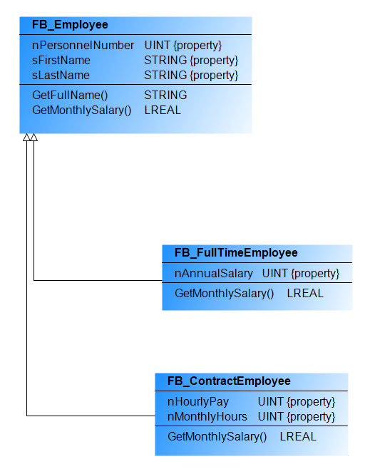
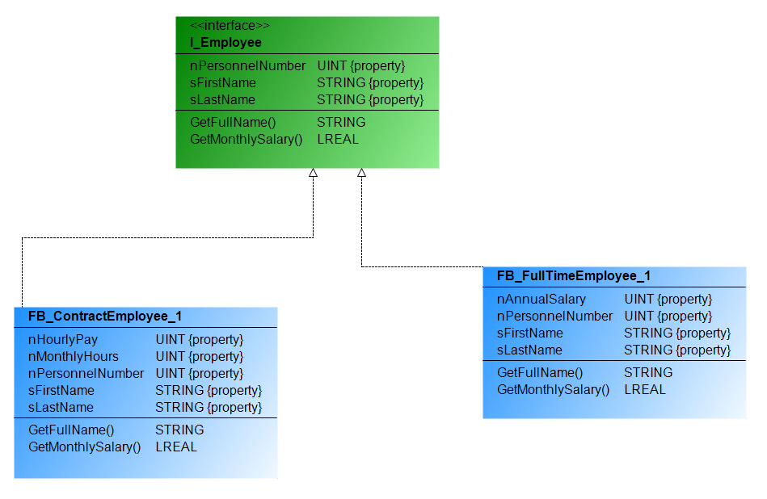
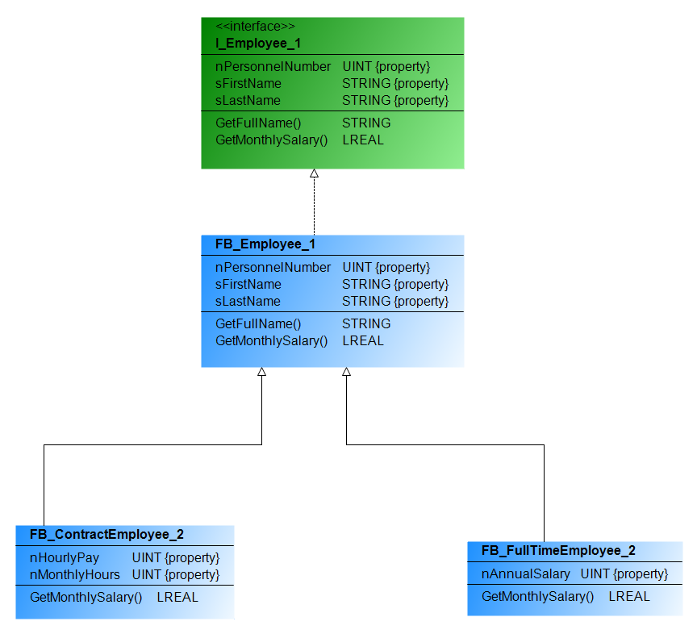

### <span style="color:grey"> Abstract FB in front of interface:</span>

The difference between using an abstract function block and an interface is that the abstract FB is a type of template that defines a set of variables and input/output parameters to be used in different parts of the program. 

On the other hand, an interface defines a set of methods and attributes (properties) which must be implemented by any kind that implements it. 

In summary, abstract function blocks are useful when code is needed to reuse in different parts of the program, while interfaces are useful when you want to ensure that certain classes implement certain methods.

Imagine that you have a program that controls different types of engines, such as electric motors, gasoline engines and diesel engines.To create a modular and reusable structure, you could create an abstract function called "motor controller" that has inputs for the type of motor, speed and direction.Then, this abstract function block can be used in different parts of the program to control the different engines.The abstract function block defines a common template that is used in different parts of the program.On the other hand, if you wanted to make sure that all classes that control engines implement certain methods (For example, a method to turn on the engine and another to turn it off), You could create an interface called "motor controller" that defines these methods.Then, any class that implements this interface must implement these methods.In summary, abstract function blocks are useful when code is needed to reuse in different parts of the program, while interfaces are useful when you want to ensure that certain classes implement certain methods.

- The functions blocks, methods and properties can be marked as abstract."from TwinCAT V3.1 build 4024".
- Abstract FBs can only be used as basic FBs for inheritance.
- The direct instantiation of abstract FBS is not possible. Therefore, abstract FBs have some similarity to interfaces.

Now, the question is in what case an interface should be used and in which case an abstract FB.
### <span style="color:grey">Abstract methods:</span>
```javascript
METHOD PUBLIC ABSTRACT DoSomething : LREAL
```

- They consist exclusively in the statement and do not contain any implementation.The body of the method is empty.
- It can be public, protected or internal.The private access modifier is not allowed.
- It cannot be additionally declared as definitive.
### <span style="color:grey">Abstract properties:</span>
```javascript
PROPERTY PUBLIC ABSTRACT nAnyValue : UINT
```

- Can contain getters, setters or both.
- Getter and Setter consist only of the statement and do not contain any implementation.
- It can be public, protected or internal.The private access modifier is not allowed.
- It cannot be additionally declared as definitive.
### <span style="color:grey">Blocks of abstract functions:</span>
```javascript
FUNCTION_BLOCK PUBLIC ABSTRACT FB_Foo
```

- As soon as a method or property is declared as abstract, the functions block must also be declared as abstract.
- Instances cannot be created from abstract FB.Abstract FBs can only be used as basic FBs when inherited.
- All abstract methods and all abstract properties must be overwritten to create a non -abstract FB.An abstract method or an abstract property becomes a non -abstract method or a non -abstract property when overwritten.
- Abstract functions blocks can also contain non -abstract methods and/or non -abstract properties.
- If all abstract methods or all abstract properties during inheritance are not overwritten, the FB inherited can only be an abstract FB (Step by step).
- Pointers or references of abstract FB type are allowed.However, these can refer to non -abstract FB and, therefore, call their methods or properties (polymorphism).
### <span style="color:grey">Differences between abstract FB and an interface:</span>
If a block of functions consists exclusively of abstract methods and abstract properties, then it does not contain any implementation and, therefore, has some similarity to the interfaces.However, there are some special characteristics to consider in detail.

|  | **Interface**  | **Abstract FB** |
|:------------- |:----------------| :-------------| 
| **Admits multiple inheritance**         | + | - |
| **may contain local variables**       | - | + |
| **It can contain non -abstract methods**          | - | + |
| **It can contain non -abstract properties**       | - | + |
| **admits more access modifiers as well as public**        | - | + | 
| **Applicable with matrix**      | + | Just spent the pointer |

The table can give the impression that interfaces can be replaced almost completely with abstract FB.However, interfaces offer greater flexibility because they can be used in different inheritance hierarchies.

Therefore, as a developer, you want to know when an interface should be used and when an abstract FB should be used.The simple answer is preferably both at the same time.This provides a standard implementation in the FB abstract base, which facilitates its derivation.However, each developer has the freedom to implement the interface directly.
### <span style="color:grey">Example:</span>
The functions blocks must be designed for employee data management.A distinction is made between permanent employees ( FB_FullTimeEmployee ) ycontract employees ( FB_ContractEmployee ). Each employee is identified by name ( sFirstName ), last name ( sLastName ) and the personnel number ( nPersonnelNumber ). The corresponding properties are provided for this purpose.In addition, a method generated by the full name is required, including the number of personnel, such as a formatted chain ( GetFullName() ). The calculation of monthly income is made through the method GetMonthlySalary().

We will solve it in 3 different ways:

- ### 1. Solution Approach: Abstract FB


- ### 2. Solution Approach: Interface


- ### 3. Solution Approach: Combination of abstract and interface FB

### <span style="color:grey">Resumen, Conclusiones:</span>
- If the user should not create an instance of the FB (Because this does not seem to be useful), then abstract FBs or interfaces are useful.
- If you want to have the possibility to generalize in more than one basic type, an interface should be used.
- If an FB can be configured without implementing methods or properties, an interface should be preferred to an abstract FB.
### <span style="color:grey">Links FB Abstract against the interface:</span>
- 🔗 [FB abastracto frente a interfaz, stefanhenneken.net](https://stefanhenneken.net/2020/12/13/iec-61131-3-abstract-fb-vs-interface/)

- 🔗 [The ABSTRACT keyword, www.plccoder.com ](https://www.plccoder.com/abstract/)

- 🔗 [ABSTRACT concept, infosys.beckhoff.com ](https://infosys.beckhoff.com/english.php?content=../content/1033/tc3_plc_intro/6413748235.html&id=)

***
### <span style="color:grey">Link to the Youtube Video 013:</span>
- 🔗 [013 - OOP IEC 61131-3 PLC -- FB Abstract vs Interface](https://youtu.be/b-KRLmblh6g)
