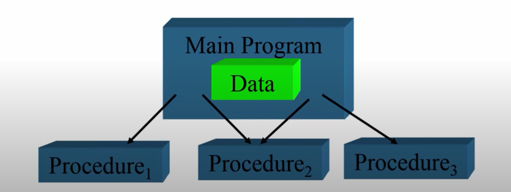
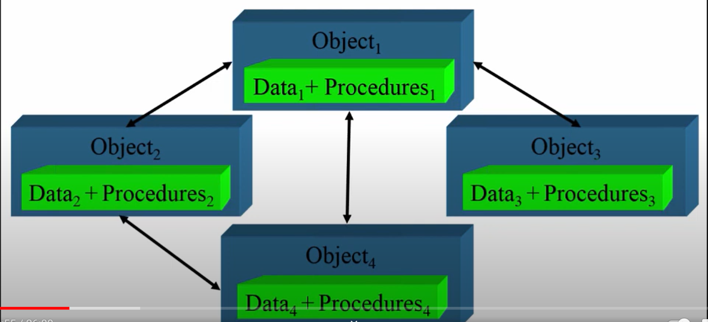

### <span style="color:grey">Types of Paradigms:</span>

- <span style="color:blue"><font size="4">Imperative --</font></span> (**Instructions to follow ** To solve a problem).
- <span style="color:blue"><font size="4">Declarative --</font></span> (Se ** focuses on the problem ** to solve).
- <span style="color:blue"><font size="4">Structured --</font></span> (The solution to a problem follows ** a sequence from start to finish **).
- <span style="color:blue"><font size="4">Functional --</font></span> (Divide the problem into various solutions that will be executed by the ** declared functions **).
Procedural programming or procedure programming is a programming paradigm. Many times it is applicable both in low -level programming languages and in high -level languages. In the event that this technique is applied in high -level languages, it will receive the name of functional programming.

    - They are called separate routines from the main program
    - Most global data -> No protection.
    - The procedures can usually be independent -> bad reuse of the code.



- <span style="color:orange"><font size="4"> Object -oriented </font></span> -- Build ** objects based on objects**.
```text
wikipedia:
Object -oriented programming is a programming paradigm
Based on the concept of "objects", which can contain data and code.
The data is in the form of fields and the code is in the form of procedures.
```


### <span style="color:grey"> ADVANTAGES OF PROGRAMMING with OOP:</span>
- routines and data are combined in an object -> encapsulation.
- Methods/Properties -> Interface defined for calls and data access.

***
### <span style="color:grey">Link to the Youtube Video 002:</span>
- 🔗 [002 - OOP IEC 61131-3 PLC -- Clase y Objeto](https://youtu.be/3IudQIj1noo)
- 🔗 [003 - OOP IEC 61131-3 PLC -- Clase y Objeto](https://youtu.be/lchxx28wwXM)