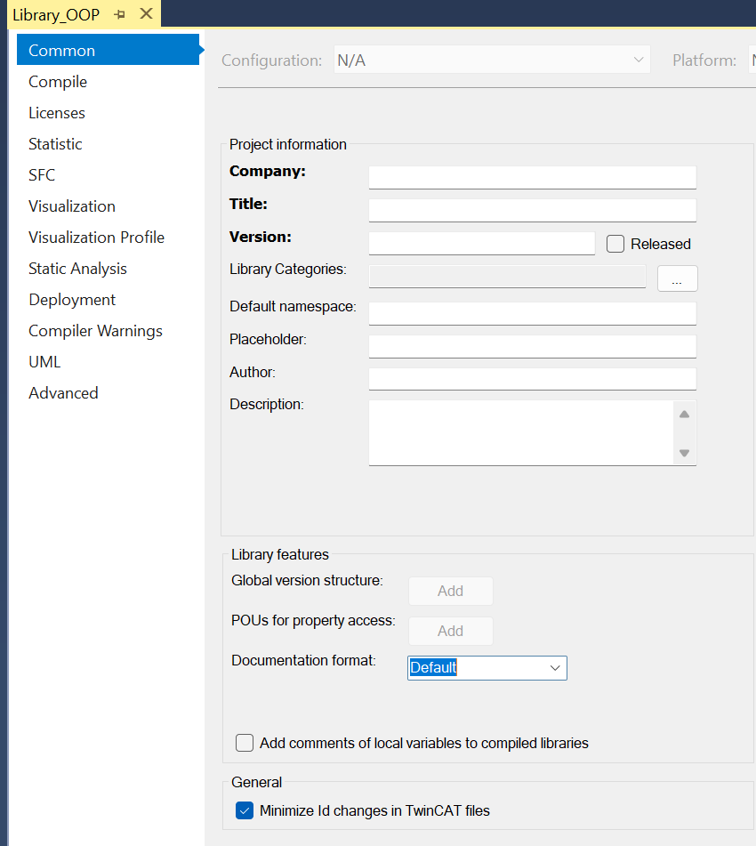

### <span style="color:grey"> Librerias:</span>
Cuando desarrollas un proyecto, ¿qué haces cuando quieres reutilizar el mismo programa para otro proyecto?. 
Probablemente el más común es copiar y pegar.
Esto está bien para proyectos pequeños, pero a medida que crece la aplicación, las bibliotecas nos permiten administrar las funciones y los bloques de funciones que hemos creado.

Mediante el uso de bibliotecas, podemos administrar el software que hemos creado en múltiples proyectos. En primer lugar, es un hecho que diferentes dispositivos tendrán diferentes funciones, pero aun así, siempre habrá partes comunes. 
En el mundo del desarrollo de software, este concepto de gestión de bibliotecas es bastante común.

### <span style="color:grey">¿Cuáles son las ventajas de usar las bibliotecas (Librerias)?</span>

- El software es modular, por ejemplo, si tengo software para cilindros, puedo usar la biblioteca de cilindros, y si tengo software para registro, puedo usar la biblioteca de registro.
- Cada biblioteca se prueba de forma independiente.
***
### <span style="color:grey">Ajustes de Configuración en el IDE Visual Studio XAE para GIT: </span>
- 1 -- Tools --> Options --> Source Control --> Plug-in Selection --> Current source control plug-in: Git
- 2 -- Tools --> Options --> TwinCAT --> XAE Environment --> File settings -- enable all to: True
- 3 -- Tools --> Options --> TwinCAT --> PLC Environment --> Write Options -- Separate LineIDs : True
    - 🔗 [s-linedid](https://automacaoweb.wordpress.com/2022/07/26/vcs-linedid/)
### <span style="color:grey">Ajustes de Configuración en el IDE Visual Studio XAE Opcionales: </span>
- 1 -- (Optional): Tools --> Options --> TwinCAT --> PLC Environment --> Text Editor --> Text area --> End of line markers : Enable
- 2 -- (Optional): Tools --> Options --> TwinCAT --> PLC Environment --> Smart coding -- Declared unknow variables automatically/(AutoDeclare) : Deselect
***
### <span style="color:grey">Cambios de Configuración despues de la creación de un proyecto nuevo: </span>
- 1 -- Properties --> Common --> Minimize ID changes in TwinCAT files : Enable
- 2 -- Properties --> Advanced -- Write product version in files -- Deselect
- 3 -- Mantener enlaces no restaurados
    - 🔗 [vcs-manter-links-nao-restaurados-keep-unrestored-links](https://automacaoweb.wordpress.com/2022/07/25/vcs-manter-links-nao-restaurados-keep-unrestored-links/)
- 4 -- al finalizar el proyecto : Pin Version
    - 🔗 [-pin-version](https://automacaoweb.wordpress.com/2022/07/25/vcs-pin-version/)
- 5 -- al finalizar el proyecto : Fijar versiones de bibliotecas
    - 🔗 [vcs-fixar-versoes-das-bibliotecas](https://automacaoweb.wordpress.com/2022/07/25/vcs-fixar-versoes-das-bibliotecas/)
    - 🔗 [managing-twincat-libraries](https://alltwincat.com/2018/03/01/managing-twincat-libraries/)
    - 🔗 [managing-twincat-libraries-jakob-sagatowski](https://www.linkedin.com/pulse/managing-twincat-libraries-jakob-sagatowski/)
***
### <span style="color:grey">Links para Configuración del IDE y del proyecto : </span>
- 🔗 [5 TwinCAT settings I always change](https://www.youtube.com/watch?v=KKpBtaYjfWo&t=5s)
- 🔗  [TC3 – Control de versiones con Git/GitHub](https://automacaoweb.wordpress.com/2022/07/25/tc3-controle-de-versao/)
***
### <span style="color:grey">Configuración Common para el proyecto de Librerias: </span>
- 🔗 [soup01.com,beckhofftwincat3-library-management](http://soup01.com/en/2023/05/11/beckhofftwincat3-library-management/)
- 🔗 [PLC programming using TwinCAT 3 - Libraries (Part 11/18)](https://www.youtube.com/watch?v=rWWPWuUYFbg)
- 🔗 [project-build-version-in-runtime](https://alltwincat.com/2017/06/06/project-build-version-in-runtime/)
- 🔗 [library-categories](https://alltwincat.com/2018/08/16/library-categories/)
- 🔗 [TwinCAT-LibraryCategories](https://github.com/sagatowski/TwinCAT-LibraryCategories)
- 🔗 [www.guidgenerator.com](https://www.guidgenerator.com/)
- 🔗 [Command Properties (PLC project),Category Common](https://infosys.beckhoff.com/content/1033/tc3_plc_intro/3260045067.html?id=49844948578869775)

    
### <span style="color:grey">¿Donde encontrar las librerias creadas de este Curso de OOP?</span>
- 📚 👉 [Proyecto Librerias creadas](https://github.com/runtimevic/OOP-IEC61131-3--Curso-Youtube/tree/master/Library)
***
### <span style="color:grey">Links Librerias:</span>

- 🔗 [help.codesys.com,_cds_obj_library_manager/](https://help.codesys.com/api-content/2/codesys/3.5.13.0/en/_cds_obj_library_manager/)
- 🔗 [help.codesys.com,_cds_library_development_information/](https://help.codesys.com/api-content/2/codesys/3.5.13.0/en/_cds_library_development_information/)
- 🔗 [help.codesys.com,_tm_test_action_libraries_addlibrary](https://help.codesys.com/webapp/_tm_test_action_libraries_addlibrary;product=codesys_test_manager;version=4.3.1.0)
- 🔗 [CODESYS Webinar Library Management Basics](https://www.youtube.com/watch?v=A4lQGWAUTgs)
- 🔗 [CoDeSys - How to add libraries and more with Machine Control Studio.](https://www.youtube.com/watch?v=8OGPvyo99p8&t=351s)
- 🔗 [SPT Application Framework Documentation](https://beckhoff-usa-community.github.io/SPT-Libraries/index.html)
- 🔗 [Beckhoff.SPT Framework Tutorial Part1.EN](https://www.youtube.com/watch?v=oK4KR1jhLEg)

- 🔗 [Tutorial #17: Eigene CoDeSys Bibliotheken erstellen](https://www.youtube.com/watch?v=vxOG8gydUwU)

- 🔗 [CoDeSys Library Management & Creation](https://www.youtube.com/watch?v=zjzT96DIIKQ)
- 🔗 [shaswatraj.com, codesys-library-management-step-by-step-guide](https://www.shaswatraj.com/post/codesys-library-management-step-by-step-guide)

```
!!! mirar este video por ejemplo para empezar como concepto a realizar las librerias!!!
```

- 🔗 [Nguyễn Vỹ, Beckhoff & PLC - OOP Properties| TWINCAT3](https://www.youtube.com/watch?v=0pJFQtXVPVY)

- 🔗 [The Benefits of OOP in PLC Programming: A Case Study with a Conveyor System](https://www.linkedin.com/pulse/benefits-oop-plc-programming-case-study-conveyor-system-zhou-gong%3FtrackingId=9ZY5A6ECss6Eb1w64xLmJQ%253D%253D/?trackingId=9ZY5A6ECss6Eb1w64xLmJQ%3D%3D)


***
### <span style="color:grey">Links a los Videos de Youtube 57,58,59:</span>
- 🔗 [057 - OOP IEC 61131-3 PLC -- Librerias - parte_01](https://youtu.be/Kox2D_l65CA)
- 🔗 [058 - OOP IEC 61131-3 PLC -- Librerias - parte_02](https://youtu.be/krtj_cOGvzA)
- 🔗 [059 - OOP IEC 61131-3 PLC -- Librerias - parte_03]()
- 🔗 [060 - OOP IEC 61131-3 PLC -- Librerias - parte_04]()


