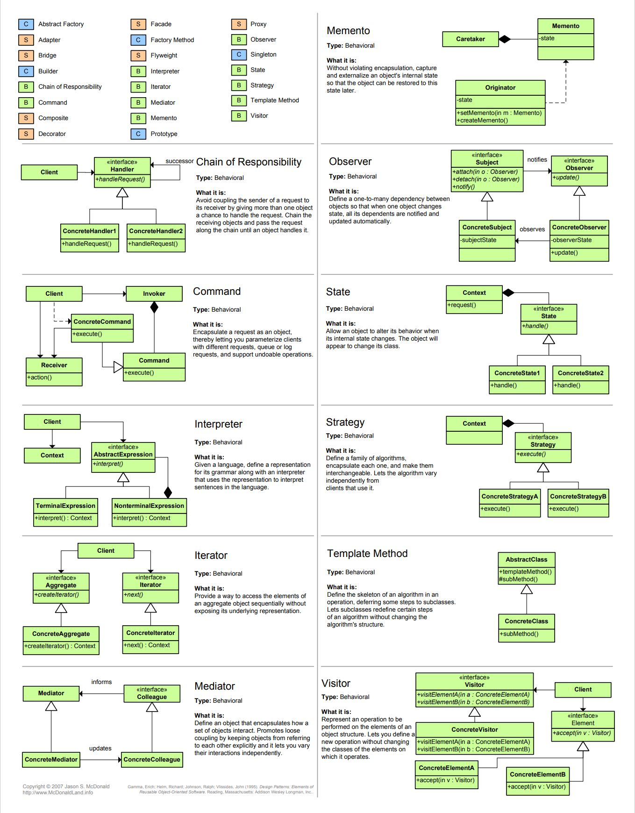
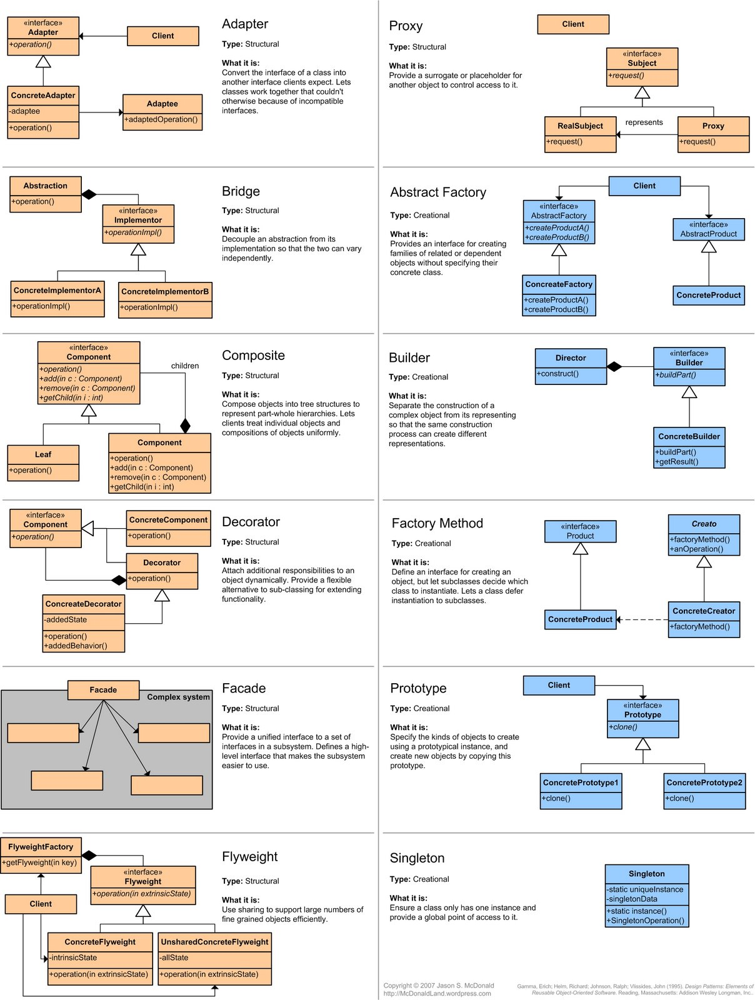

El proyecto con todos los patrones de Diseño lo podremos encontrar en:
### 📚 👉 [Proyecto TwinCAT Patrones de Diseño](https://github.com/runtimevic/OOP-IEC61131-3--Curso-Youtube/tree/master/TC3_Design_Patterns)
### 📚 👉 [Ficheros PLCOpen XML Patrones de Diseño](https://github.com/runtimevic/OOP-IEC61131-3--Curso-Youtube/tree/master/Ficheros_PLCOpen_XML_Design_Patterns)
### 📚 👉 [Proyectos *.tpzip TwinCAT Patrones de Diseño](https://github.com/runtimevic/OOP-IEC61131-3--Curso-Youtube/tree/master/TC3_Design_Patterns_projects_tpzip)

Imagen de los patrones de Diseño:


- Los patrones de diseño son soluciones generales y reutilizables para problemas comunes que se encuentran en la programación de software.
- En la programación orientada a objetos, existen muchos patrones de diseño que se pueden aplicar para mejorar la modularidad, la flexibilidad y el mantenimiento del código.
- Algunos ejemplos de patrones de diseño que se pueden aplicar en la programación de PLCs incluyen el patrón Singleton, el patrón Factory Method, el patrón Observer y el patrón Strategy.
- Por ejemplo, el patrón Singleton se utiliza para garantizar que solo exista una instancia de una clase determinada en todo el programa. Esto puede ser útil en la programación de PLCs cuando se quiere asegurar que solo hay una instancia activa del objeto que controla un determinado proceso o dispositivo.
- El patrón Factory Method se utiliza para crear instancias de objetos sin especificar explícitamente la clase concreta a instanciar. Esto puede ser útil en la programación de PLCs cuando se quiere crear objetos según las necesidades específicas del programa.
- El patrón Observer se utiliza para establecer una relación uno a muchos entre objetos, de manera que cuando un objeto cambia su estado, todos los objetos relacionados son notificados automáticamente. Este patrón puede ser muy útil en la programación de PLCs para establecer relaciones entre diferentes componentes del sistema, como sensores y actuadores. 
- El patrón Strategy se utiliza para definir un conjunto de algoritmos intercambiables, y luego encapsular cada uno como un objeto. Este patrón puede ser útil en la programación de PLCs cuando se desea cambiar dinámicamente el comportamiento del sistema según las condiciones del entorno.
- En resumen, los patrones de diseño son una herramienta muy útil para mejorar la calidad del código en la programación de PLCs y se pueden aplicar con éxito en la programación orientada a objetos para PLCs.

```text
“Los patrones de diseño son 
descripciones de objetos y clases 
conectadas que se personalizan para 
resolver un problema de diseño 
general en un contexto particular”. 
- Gang of Four 
```






### <span style="color:grey">Clasificación según su propósito:</span>
Los patrones de diseño se clasificaron originalmente en tres grupos: 

- **Creacionales.** 
- **Estructurales.**
- **De comportamiento.**

### <span style="color:grey">Clasificación según su ámbito:</span>

-	**De clase:** Basados en la herencia de clases. 
-	**De objeto:** Basados en la utilización dinámica de objetos. 

### <span style="color:grey"> Patrones Creacionales:</span>

- Los patrones de Creación abstraen la forma en que se crean los objetos, de forma que permite tratar las clases a crear de forma genérica apartando la decisión de qué clases crear o como crearlas. 
Pero los Patrones de Diseño son conceptos aplicables directamente en la producción de software, cualquier abstracción no se queda en el aire como una entelequia que solo sirve para dar discursos, así:
Según a donde quede desplazada dicha decisión se habla de Patrones de Clase (utiliza la herencia para determinar la creación de las instancias, es decir en los constructores de las clases) o Patrones de Objeto (es en métodos de los objetos creados donde se modifica la clase) 

-	Patrones de Creación de Clase:
    -	Factoría Abstracta 
    -	Builder 
-	Patrones de Creación de Objeto: 
    -	Método Factoría 
    -	Prototipo 
    -	Singleton 
    -	Object Pool 


- Builder*
- Singleton *
- Dependency Injection 
- Service Locator 
- Abstract Factory*
- Factory Method *

### <span style="color:grey"> Patrones Estructurales:</span>
Tratan la relación entre clases, la combinación clases y la formación de estructuras de mayor complejidad. 

- Adapter
- Data Access Object (DAO)  
- Query Object 
- Decorator 
- Bridge 

### <span style="color:grey"> Patrones de Comportamiento:</span>
Los patrones de comportamiento hablan de como interaccionan entre si los objetos para conseguir ciertos resultados. 
Los principales patrones de comportamiento son: 

- Command
- Chain of Responsibility 
- Strategy
- Template Method 
- Interpreter
- Observer 
- State 
- Visitor 
- Iterator
***
Los patrones de diseño son soluciones reutilizables para problemas comunes de diseño de software. Proporcionan una forma para que los desarrolladores de software resuelvan problemas comunes de manera consistente y eficiente, sin tener que reinventar la rueda cada vez.

<span style="color:grey">Beneficios de usar Patrones de Diseño =></span>

• <span style="color:orange">Reusabilidad:</span> Evite reinventar la rueda cada vez.

• <span style="color:orange">Escalabilidad:</span> Diseño de software flexible y adaptable.

• <span style="color:orange">Capacidad de mantenimiento:</span> Código más fácil de modificar y depurar.

• <span style="color:orange">Estandarización:</span> Vocabulario común y estructura a través de diferentes proyectos.

• <span style="color:orange">Colaboración:</span> más fácil para varios desarrolladores trabajar en el mismo código base.


<span style="color:grey">Algunos patrones de diseño de uso común =></span>

• **Patrón de estrategia:** el patrón de estrategia se utiliza para definir una familia de algoritmos, encapsular cada uno y hacerlos intercambiables.

Por ejemplo, imagina que tienes un juego con diferentes tipos de personajes, cada uno con sus propias habilidades únicas. El patrón de estrategia le permitiría definir un conjunto de estrategias (es decir, algoritmos) para cada tipo de personaje y luego cambiar fácilmente entre ellas según sea necesario.

• **Patrón de observador:** el patrón de observador se utiliza para notificar a los objetos cuando hay un cambio en otro objeto.

Por ejemplo, imagine que tiene una aplicación meteorológica que necesita notificar a sus usuarios cuando cambia la temperatura. El patrón de observador le permitiría definir un conjunto de observadores (es decir, los usuarios) y luego notificarles cuando cambie la temperatura.

• **Patrón de decorador:** el patrón de decorador se utiliza para agregar funcionalidad a un objeto de forma dinámica, sin cambiar su estructura original.

Por ejemplo, imagine que tiene un automóvil y desea agregarle un sistema de navegación GPS. El patrón decorador le permitiría agregar el sistema GPS sin tener que modificar el propio automóvil.

• **Patrón de comando:** el patrón de comando se usa para encapsular una solicitud como un objeto, lo que permite que se almacene, pase y ejecute en un momento posterior.

Por ejemplo, imagina que tienes un sistema de automatización del hogar que te permite controlar las luces, el termostato y otros dispositivos. El patrón de comando le permitiría encapsular cada comando (por ejemplo, encender las luces), almacenarlo como un objeto y ejecutarlo más tarde.

• **Patrón de fábrica:** el patrón de fábrica se utiliza para crear objetos sin exponer la lógica de creación al cliente.

Por ejemplo, imagina que tienes un juego con diferentes niveles, cada uno con su propio conjunto de enemigos. El patrón de fábrica te permitiría crear enemigos para cada nivel sin exponer la lógica de creación al cliente.

• **Patrón compuesto:** el patrón compuesto se utiliza para crear una estructura de objetos en forma de árbol, donde los objetos individuales y los grupos de objetos se tratan de la misma manera.

Por ejemplo, imagine que tiene un sistema de archivos, donde los archivos y los directorios se tratan de la misma manera. El patrón compuesto le permitiría tratar archivos y directorios individuales como el mismo tipo de objeto y crear una estructura similar a un árbol de todo el sistema de archivos.
***
<span style="color:grey">Además de los Patrones de Diseño tenemos:</span>

-	**Patrones de Arquitectura:** Formas de descomponer, conectar y relacionar sistemas, trata conceptos como: niveles, tuberías y filtros. Es un nivel de abstracción mayor que el de los Patrones de Diseño. 
-	**Patrones de Programación (Idioms Patterns):** Patrones de bajo nivel acerca de un lenguaje de programación concreto, describen como** implementar cuestiones concretas. 
-	**Patrones de Analisis:** Conjunto de reglas que permiten modelar un sistema de forma satisfactoria. 
-	**Patrones de Organizacionales:** Describen como organizar grupos humanos, generalmente relacionados con el software. 
-	**Otros Patrones de Software:** Se puede hablar de patrones de Programación concurrente, de Interfaz Gráfica, de Organización de Código, de Optimización de Código, de Robustez de Código, de Fase de Prueba. 

***
### <span style="color:grey">Links de Patrones de Diseño:</span>

- 🔗 [refactoring.guru/es/design-patterns](https://refactoring.guru/es/design-patterns)
- 🔗 [0w8States/PLC-Design-Patterns](https://github.com/0w8States/PLC-Design-Patterns)
- 🔗 [github.com/Aliazzzz/Applied-Design-Patterns-in-CODESYS-V3](https://github.com/Aliazzzz/Applied-Design-Patterns-in-CODESYS-V3)
- 🔗 [sourcemaking.com/design_patterns](https://sourcemaking.com/design_patterns)
- 🔗 [Coding Together ES, Patrones de Diseño](https://www.youtube.com/playlist?list=PLAjsCEoMYsgVOD6YfwISbIo9XCDrLGxYC)
- 🔗 [medium.com, design-patterns](https://medium.com/@lucas.and227/design-patterns-in-c-f3a86cd3e57a)
- 🔗 [8 Design Patterns EVERY Developer Should Know](https://www.youtube.com/watch?v=tAuRQs_d9F8)
- 🔗 [¿Qué son los PATRONES de DISEÑO?](https://www.youtube.com/watch?v=qHuI_IWUkfA)
- 🔗 [Aprende los principales patrones de diseño con .NET y C#. Temario curso](https://www.youtube.com/watch?v=PuI7kAbPYFk)
- 🔗 [Patrones de Diseño de Software](https://www.youtube.com/playlist?list=PLM-p96nOrGcbqbL_A29b0z3KUXdq2_fpn)
- 🔗 [O que é Design Patterns (Padrões de Design)?](https://programadoresdepre.com.br/o-que-e-design-patterns-padroes-de-design/)
- 🔗 [DesignPatternsConsideredHarmful](https://wiki.c2.com/?DesignPatternsConsideredHarmful)
- 🔗 [De Cero a Experto en Arquitectura de Software, con Ángeles Vázquez | Ep 9](https://www.youtube.com/watch?v=u0kPSJa14Q8)

***
### <span style="color:grey">Link al Video de Youtube_34:</span>
- 🔗 [034 - OOP IEC 61131-3 PLC -- Patrones de Diseño - Introducción](https://youtu.be/vjWoPhHb6K0)